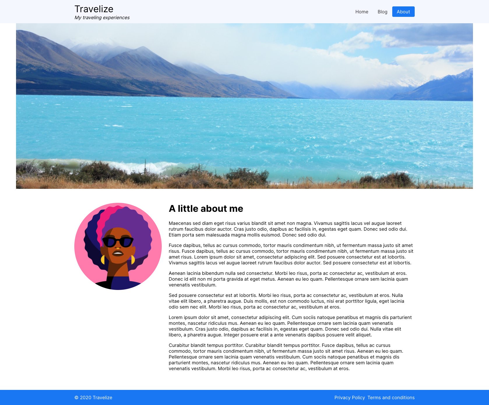

# Timescale frontend assignment

## Travel blog

You will need to style a basic profile page for a travel blog. You will need to code the HTML for the page
and style it. The page is using `create-react-app` to run and compile the page

### Setup
```
cd travel-blog
yarn install
yarn start
```

### Finished result



## Javascript questions

### Setup

```
cd javascript-questions
yarn install
yarn test
```


